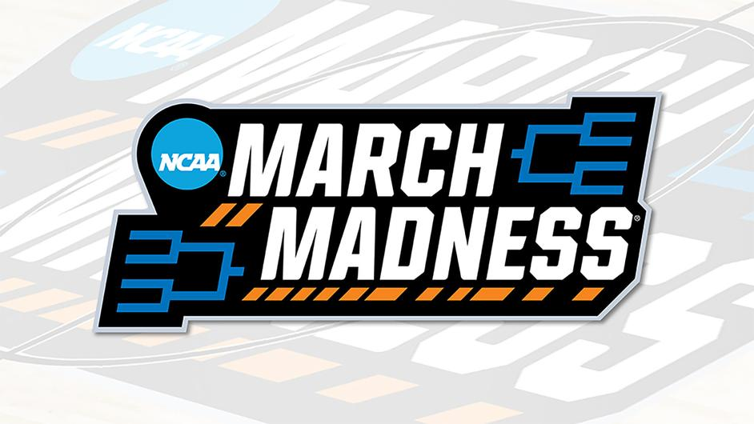

<!DOCTYPE html>
<html lang="en">
    <head>
    <meta charset="UTF-8">
    <meta name="viewport" content="width=device-width, initial-scale=1.0">
    <title>NCAA March Mania 2023</title>
    
    </head>
 <body>

  
  <!-- Thumbnail -->
  

  <!-- Title and Description -->
  

    <h1 class="section-title">NCAA March Mania 2023 - Forecast the 2023 NCAA Basketball Tournaments</h1>
    

      Goal of the Competition: Predict the outcomes of this year's college basketball tournaments with a unique combination of historical data and machine learning.
    

  

   <!-- Project Walkthrough -->
  

    <h2 class="section-title">Project Walkthrough</h2>
    

      The project entails forecasting the outcomes of the Division 1 Men's and Women's basketball tournaments based on rich historical NCAA games data. This year's competition includes several updates to the format, providing both basic and detailed datasets for model building.
    

  

  
  <!-- Results -->
  

    <h2 class="section-title">Results</h2>
    

      After performing feature engineering, an XGBoost model was implemented using K-fold cross-validation to predict the tournament outcomes. The model's performance was evaluated against historical tournament outcomes to ensure accuracy and reliability.
    

  

  
  <!-- Summary -->
  

    <h2 class="section-title">Summary</h2>
    

      The competition provided an opportunity to apply machine learning to one of the most unpredictable sports events. By leveraging historical data and advanced algorithms like XGBoost, a robust prediction model was developed to participate in the annual March Machine Learning Mania.
    

  

<footer>
      
Contact information and social links

      <a href="https://momowangg.github.io/Portfolio_Website/">Personal Website</a>
  
      <a href="https://www.linkedin.com/in/yuqiao-mike-wang/">My Linkedin</a>
</footer>
  </body>
</html>